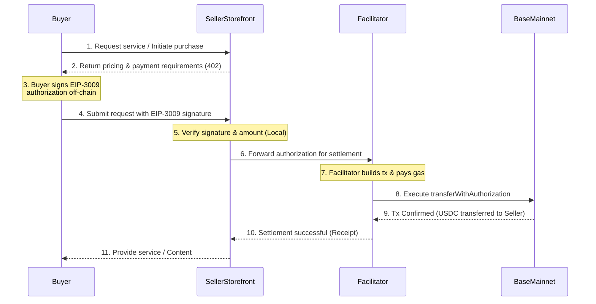

# Keyless Seller-Storefront Architecture Guide

This guide details the security model and architecture of the x402-mcp keyless seller storefront. By design, the seller node operates without holding any spending keys, enabling secure deployment on standard cloud infrastructure (like Render, Cloud Run, or AWS) without the risk of key exfiltration.

## Zero-Spend-Key Security Model

In traditional crypto commerce setups, a backend often needs to hold a private key to settle transactions, issue refunds, or pay gas fees. This introduces a significant attack vector: if the cloud instance is compromised, the funds are stolen.

The x402-mcp architecture eliminates this risk entirely:
*   **No Spending Keys**: The storefront server only holds a *receiving* address, not the private key to spend from it.
*   **EIP-3009 Authorization**: Buyers sign an EIP-3009 transfer authorization off-chain, granting the seller the right to pull a specific amount of USDC.
*   **Facilitator Settlement**: The seller forwards this authorization to a Facilitator (or relay network) that actually submits the transaction to the blockchain. The Facilitator pays the gas (ETH) and executes the transfer on Base Mainnet.
*   **Cloud-Safe**: Because the seller node cannot spend funds, a compromise of the server only results in downtime, not financial loss. It is safe to deploy the seller application on Render, Cloud Run, or any standard PaaS without complex HSMs or Key Vaults for the treasury.

## Architecture & Transaction Flow

The interaction involves the Buyer, the Seller Storefront, the Facilitator, and the Base Mainnet blockchain.

### Flow Breakdown

1.  **Initiation**: The Buyer attempts to access a protected resource or initiate a purchase.
2.  **Payment Required**: The Seller Storefront responds with a `402 Payment Required` (or similar prompt), specifying the price in USDC and the seller's receiving address.
3.  **Off-Chain Signature**: The Buyer's wallet signs an EIP-3009 `transferWithAuthorization` message. This signature is specific to the seller's address, the exact amount, and includes a nonce to prevent replay attacks. **No on-chain transaction is created by the Buyer.**
4.  **Submission**: The Buyer sends the signature and the original request to the Seller Storefront.
5.  **Local Verification**: The Seller Storefront locally verifies the signature using cryptography (e.g., recovering the signer's address) to ensure it is valid and intended for them.
6.  **Forwarding**: The Seller Storefront forwards the authorization signature to a Facilitator.
7.  **Gas Payment & Settlement**: The Facilitator, who holds ETH for gas on Base, wraps the authorization in a transaction and submits it to the Base Mainnet.
8.  **Blockchain Execution**: The Base Mainnet executes the USDC contract's `transferWithAuthorization` function, moving USDC from the Buyer to the Seller.
9.  **Confirmation**: The Facilitator receives confirmation from the blockchain and notifies the Seller Storefront.
10. **Service Delivery**: The Seller Storefront, now assured of payment, delivers the requested service or content to the Buyer.

This architecture ensures high security for the seller while maintaining a smooth, gasless experience for the buyer (who only signs a message, while the Facilitator abstracts the gas payment).
